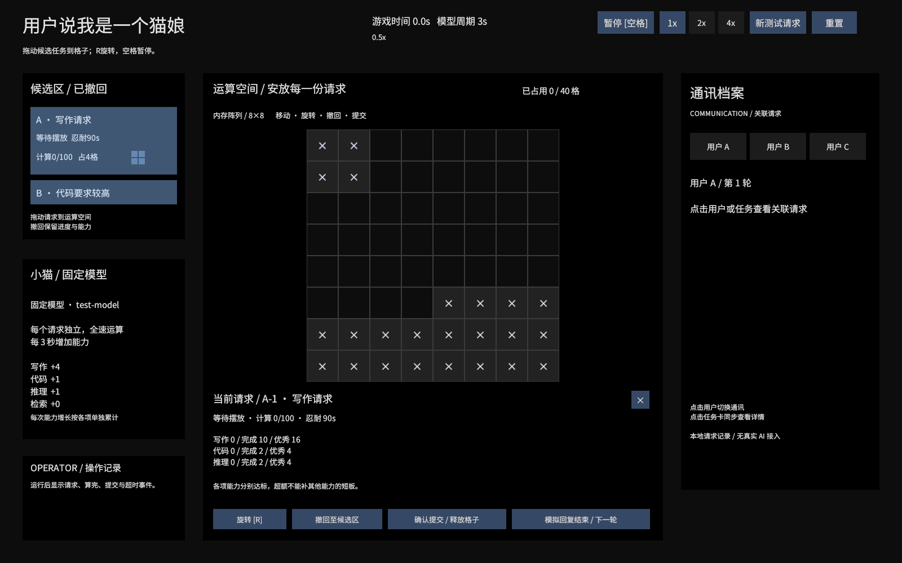

# Canvas 界面与美术协作

打开 `Assets/_Game/Scenes/Prototypes/CoreGameplay.unity`，界面已经保存在场景里，编辑模式下即可看到与调整。点击 Play 验证交互。布局基准为 1600×1000，CanvasScaler 随屏幕高度缩放。

## 场景对象

`GameplayCanvas` 下包含：

- `Header`：标题、时间、提示与暂停/倍速/新增/重置按钮。
- `CandidatePanel`：候选区、滚动列表和初始三个请求卡。
- `BoardPanel`：运算格子、运行任务块容器、操作日志。
- `MemoryPanel`：复用用户新增面板，显示模型周期与各项能力点数。
- `BoardPanel/SelectedRequestPanel`：当前任务详情、逐项能力、质量和操作按钮。
- `ConversationPanel`：常驻通讯档案，用户A/B/C按钮选择该用户最新请求。
- `DragLayer`：拖拽预览容器。

美术可直接修改面板与按钮的 `Image.Source Image`、`Text.Font`、颜色和 `RectTransform`。按钮的 `On Click` 已在场景里绑定控制器方法，不需要重新写事件代码。

## 可复用 Prefab

位置：`Assets/_Game/Prefabs/UI/CoreGameplay/`。

| Prefab | 用途 | 主要替换位置 |
|---|---|---|
| RequestCard | 候选任务卡 | 根 Image、文字与 SelectionBorder、ShapePreview |
| TaskModule | 格子上的任务块与拖拽预览 | ShapeCells、RequestLabel、ProgressFill；状态颜色在 TaskModuleView 中配置 |
| TaskCell | 每个任务形状的单格 | 根 Image、CellLabel |
| GridCell | 运算底板格子 | 根 Image、LockedMarker；开放/锁定颜色在 GridCellView 中配置 |

在 Prefab Mode 编辑这些资源，修改后同步到场景实例与运行时实例。初始任务卡的名称与请求 ID 是场景实例覆盖，样式仍来自 Prefab。新增任务和形状的格子通过这些 Prefab 实例化。

`CoreGameplayCanvasView` 的 Inspector 保存所有场景对象与 Prefab 引用。替换对象时把新组件拖回对应字段；保留控制组件与引用即可调整外观。若更换字体，需同时修改场景静态文字与各 Prefab 的文字。默认使用 Noto Sans CJK SC，许可证位于字体目录。

## 程序边界

- `CoreGameplayController`：调用原有 TaskSimulation、驱动统一游戏时间、处理按钮命令、读取并分发事件。
- `CoreGameplayCanvasView`：将状态更新到现有 UI，处理屏幕坐标与格子坐标、合法/非法预览。
- `TaskCardView` / `TaskModuleView`：接收 EventSystem 的点击与拖放事件。
- `TaskSimulation`：规则、占格、计算、能力与质量，不依赖 Canvas。

运行时更新文字、状态色、可用性与任务形状，不重新生成静态面板或按钮。任务形状的位置和格子尺寸由棋盘计算；其图片、字体、状态色由资源与 Inspector 控制。

当前场景是 8×8 棋盘。更改棋盘宽高时，需要同步调整场景里的 GridCells 数量/布局和 CanvasView 的 gridCells 引用；模型、任务形状与能力数值继续在 CoreGameplayConfiguration 中配置。

一次性场景生成和Canvas迁移脚本已删除。现在直接编辑保存的场景和Prefab即可，不需要执行生成菜单。代码结构见 [CODE_STRUCTURE.md](CODE_STRUCTURE.md)。

## 验证方式

Unity Test Runner 的 EditMode 下运行 `CallmeCatgirl.TaskGrid.Tests`。Canvas 集成测试会进入 Play Mode，检查场景中已有 Canvas、合法放置、非法拖放保留原位置、撤回重放、逐项能力产出和按钮提交。它不替代美术效果与不同屏幕比例的人工检查。

## 当前布局与逻辑

按参考图调整为左侧候选/模型、中间格子/任务详情、右侧通讯。顶部1×/2×/4×直接设置播放速度。占格显示读取实际开放格配置，不照抄参考图数值。收起任务详情后，通讯仍保留，点击用户或任务重新显示详情。MemoryPanel当前展示固定模型数据，正式聊天内容与记忆存储仍由后续系统接入。

