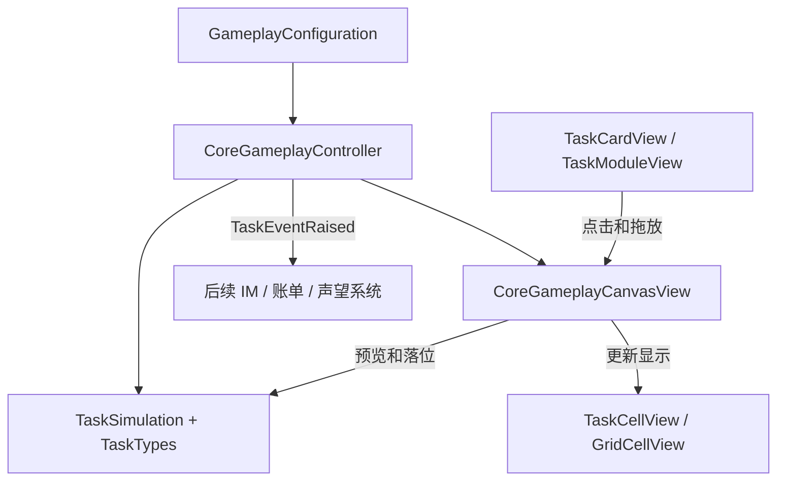

# 当前代码结构与对接说明

本文覆盖 `C:\unity\CallmeCatgirl` 中本次生成的 Unity 玩法代码，并列出此前生成的独立网页原型。Unity 模板自带的 `Readme.cs` / `ReadmeEditor.cs` 不是玩法实现。

## 文件结构

```text
Assets/_Game/
  Scripts/Runtime/
    Gameplay/
      GameplayConfiguration.cs
      TaskGrid/
        TaskTypes.cs
        TaskSimulation.cs
        CallmeCatgirl.TaskGrid.asmdef
    UI/
      CoreGameplayController.cs
      CoreGameplayCanvasView.cs
      TaskCardView.cs
      TaskModuleView.cs
      TaskCellView.cs
      GridCellView.cs
  Tests/EditMode/TaskGrid/
    TaskSimulationTests.cs
    CoreGameplaySceneTests.cs
    CoreGameplayCanvasTests.cs
    CallmeCatgirl.TaskGrid.Tests.asmdef

Prototypes/ai-space/
  index.html
  engine.js
  README.md
```

共保留 9 个 Unity 运行脚本、3 个测试脚本和 2 个程序集定义。网页原型有 2 个代码文件，独立于 Unity。

## 运行代码

| 文件 | 内部结构和职责 | 使用位置 |
|---|---|---|
| TaskTypes.cs | `Cell` 格子坐标；能力、状态、质量、摆放失败、事件类型枚举；`AbilityRequirement` 单项门槛；`TaskDefinition` 固定任务定义及形状旋转；`ModelDefinition` 能力频率与点数；`TaskInstance` 本轮任务运行状态；`QualityResult` 逐项判质并取最低档；`TaskEvent` 结算和状态事件；`Rules` 数值检查 | 纯 C# 数据模型，不挂场景 |
| TaskSimulation.cs | 保存开放格、占格、请求、会话/轮次索引和待分发事件；执行创建、放置、旋转、撤回、计算、判质、提交、超时及换模 | 核心规则对象，由控制器创建 |
| GameplayConfiguration.cs | ScriptableObject 配置；棋盘大小/开放格、模型周期/能力点数、播放速度与初始任务；`DemoTask.Build()` 将 Inspector 数据转成逻辑模型 | `Data/TaskGrid/CoreGameplayConfiguration.asset` |
| CoreGameplayController.cs | `Awake/Start` 初始化模型和视图；`Update` 驱动统一时间与键盘操作；按钮命令；选中任务；新增/重置/下一轮；读取逻辑事件并更新日志、通过 `TaskEventRaised` 分发 | 场景 `Core Gameplay` 对象；虽然文件在 UI 目录，职责是玩法与界面协调 |
| CoreGameplayCanvasView.cs | 保存场景文字、按钮、面板、棋盘和 Prefab 引用；维护任务卡/任务块字典；`Refresh` 更新显示；`RefreshInfo` 控制关联会话；拖放时把屏幕坐标换成格子坐标，创建合法/非法预览并调用摆放 API | 场景 `GameplayCanvas` 对象 |
| TaskCardView.cs | 绑定请求 ID；刷新标题、状态、进度、选中状态与缩略形状；把点击和拖放转交 CanvasView | `RequestCard.prefab` |
| TaskModuleView.cs | 根据任务形状绘制单格；显示请求 ID、进度和运行/选中/待提交/合法或非法预览颜色；转交点击和拖放 | `TaskModule.prefab` |
| TaskCellView.cs | 封装任务单格的背景 Image 和文字，提供 `Show` | `TaskCell.prefab` |
| GridCellView.cs | 显示底板格子开放/锁定颜色和锁定标记，提供 `Show` | `GridCell.prefab` |

### 调用关系



例如：从候选区拖动 A，请求卡把鼠标事件交给 CanvasView；CanvasView 计算格子位置、查询 `Preview` 并在松手时执行 `TryPlace`；控制器每帧调用 `Advance`；完成后规则层冻结逐项质量；CanvasView 显示“待提交”；提交按钮调用控制器，控制器调用 `TrySubmit`，然后分发结算事件。

主面板和按钮已经序列化在场景中。运行时创建的是新增请求、运行任务块、拖拽预览和任务形状的单格实例，使用已保存的 Prefab。

## 程序接入位置

| 接口 | 用途 |
|---|---|
| `TaskSimulation.TryCreate(...)` | 接入 IM 的新请求，绑定会话和轮次 |
| `Preview(...)` / `TryPlace(...)` | 接入新的拖放或自动安排界面 |
| `TryWithdraw(...)` / `TrySubmit(...)` | 撤回与确认提交 |
| `TryCloseFeedback(...)` | 正式 IM 回复结束后开放下一轮 |
| `TryChangeModel(...)` | 后续模型选择；当前要求全局暂停 |
| `Advance(...)` / `Paused` | 统一时间与暂停，由一个驱动负责 |
| `CoreGameplayController.TaskEventRaised` | 订阅提交、超时、准备完成等事件，接入账单、IM、声望 |
| `GameplayConfiguration` | 在 Inspector 修改目前的验证数值 |
| `CoreGameplayCanvasView` 的序列化字段 | 更换 UI 对象和 Prefab 后重新绑定引用 |

控制器已经负责读取 `DrainEvents()`。后续系统使用控制器的 `TaskEventRaised` 订阅事件，不要再独立取走同一事件队列。

当前 Inspector 的任务能力门槛包括写作、代码、推理；模型点数还包含检索。规则模型能表示检索要求，但目前 DemoTask 的 Inspector 没有检索门槛字段。这里保留现有功能，没有额外扩大实现范围。

## 测试与程序集

| 文件 | 验证内容 / 存在理由 |
|---|---|
| TaskSimulationTests.cs | 纯规则测试：非法落位不破坏原状态、旋转、开放格、并发、暂停、撤回、计频、超时、逐项质量、单次提交、会话绑定与换模 |
| CoreGameplaySceneTests.cs | 打开保存的真实场景并进入 Play Mode，检查配置、12/3/3 产出、质量和单次提交 |
| CoreGameplayCanvasTests.cs | 场景 Canvas、EventSystem 拖放、非法移动保留原位置、旋转/暂停按钮、撤回重放和提交按钮 |
| CallmeCatgirl.TaskGrid.asmdef | 将纯逻辑独立成无 UnityEngine 依赖的程序集 |
| CallmeCatgirl.TaskGrid.Tests.asmdef | 将测试隔离到 Editor/Test Runner，避免进入正式游戏构建 |

这三份测试关注不同层次，保留用于防止后续功能和美术替换破坏现有行为。

## 旧网页原型

| 文件 | 职责 |
|---|---|
| `Prototypes/ai-space/engine.js` | 独立 `Game` 模型、任务阶段、形状/旋转、占格、时间、暂停、流程模块、记忆与经验的旧玩法实验 |
| `Prototypes/ai-space/index.html` | HTML/CSS、浏览器 Canvas、界面更新、鼠标拖放、播放控制；加载 engine.js |

网页原型使用较早的玩法规则，用于独立试玩和分享，不作为当前 Unity 数值与规则的来源。网页文件、README、分享压缩包及截图仍保留。

## 清理结果

- 删除 `Scripts/Editor/CoreGameplaySetup.cs` 与 `.meta`：初版场景、相机、配置和 Build Settings 的一次性生成工具，资源已经保存。
- 删除 `Scripts/Editor/CoreGameplayCanvasSetup.cs` 与 `.meta`：一次性 Canvas/Prefab 迁移工具，当前场景与 Prefab 无需依靠它运行。
- 删除旧网页原型的 `rendered-dom.html` 和 `render.log`：自动化渲染输出，不是运行入口。
- 已去掉文档中的旧工具菜单说明；以后直接打开 `CoreGameplay.unity`，编辑保存的场景与 Prefab。

本次删除前的文件备份记录于 `C:\Users\HeJunhan\Documents\CoreGameplayCleanupBackup`。未删除 Unity 自动缓存、用户改动、美术资源、配置、模板脚本或独立可运行的原型。

清理后验证（2026-10-10）：在复制当前 Assets 与 ProjectSettings 的隔离项目中实际编译并运行测试，29/29 通过。测试副本同样移除了场景生成、Canvas迁移、临时桥接与截图脚本。报告为 Logs/CoreGameplay-Cleanup-EditMode.xml。

参考布局改动：未增加运行脚本。CoreGameplayCanvasView新增occupancyLabel/modelLabel/conversationLabel三项场景引用，CoreGameplayController新增SelectConversation与SetSpeed接口。已复用MemoryPanel，任务详情由SelectedRequestPanel承载，ConversationPanel常驻显示。一次性布局编辑脚本仅在隔离副本使用并已移除。
